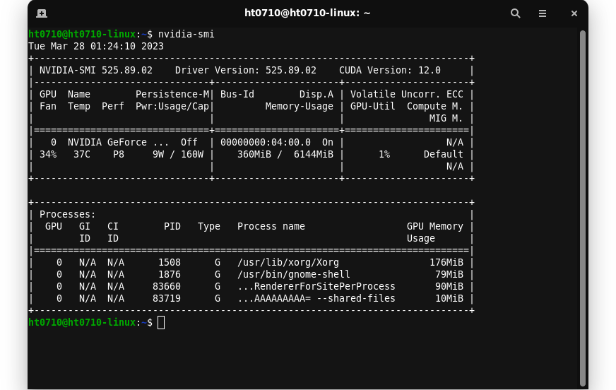
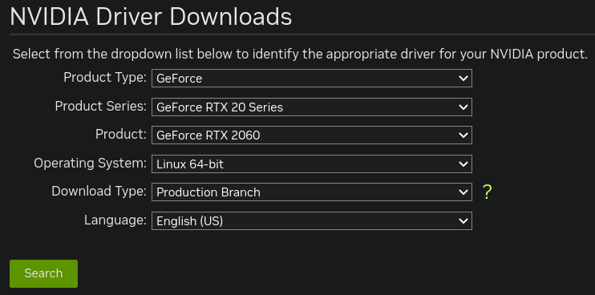
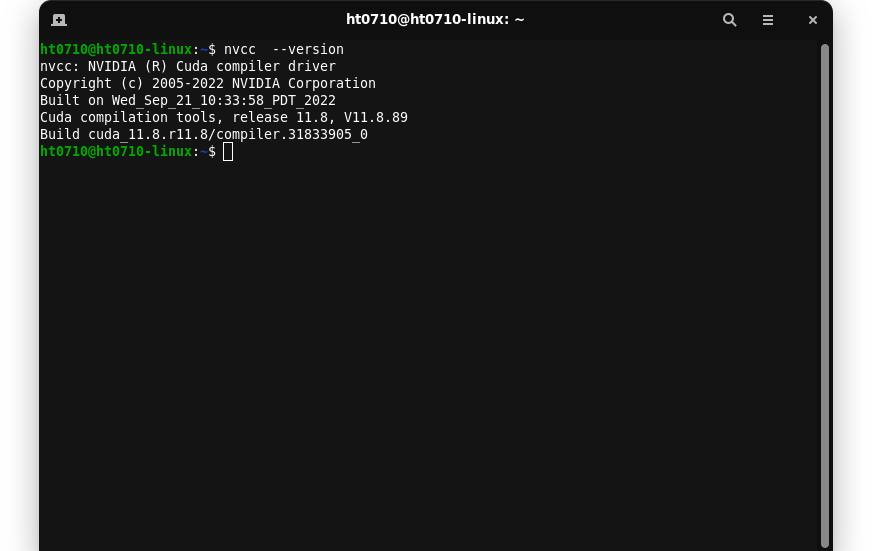
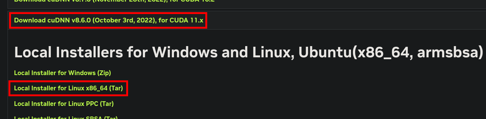
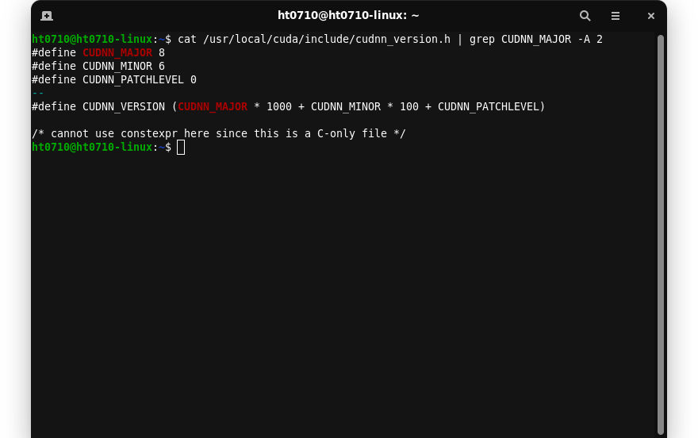

# <p align="center">How to install CUDA, CuDNN, TensorFlow and Pytorch</p>


## Table of Contents
- [How to install CUDA, CuDNN, TensorFlow and Pytorch](#how-to-install-cuda-cudnn-tensorflow-and-pytorch)
  - [Table of Contents](#table-of-contents)
  - [Introduction](#introduction)
  - [**Requirements**](#requirements)
    - [System](#system)
    - [Software](#software)
  - [**Preparation (IMPORTANT)**](#preparation-important)
    - [1. NVIDIA Driver](#1-nvidia-driver)
      - [Verification](#verification)
    - [2. Miniconda](#2-miniconda)
      - [Verification](#verification-1)
  - [**Install CUDA**](#install-cuda)
      - [Verification](#verification-2)
  - [**Install CuDNN**](#install-cudnn)
      - [Verification](#verification-3)
  - [**Install TensorFlow**](#install-tensorflow)
  - [**Install Pytorch**](#install-pytorch)


## Introduction
Having trouble getting your deep learning model to run on GPU. Please follow the instructions.

This is a step by step instructions of how to install:
```
- CUDA 11.8
- CuDNN 8.6.0
- TensorFlow 2.12.*
- Pytorch 2.0
```

**Note:**
- You can skip TensorFlow or Pytorch if don't use it.
- Pytorch come with it own CuDNN so you can skip CuDNN installation if use Pytorch only.

## **Requirements**
### System
```
- Ubuntu 16.04 or higher (64-bit)
- NVIDIA Graphics Card *
```

**Note:**
- \* AMD doesn't have CUDA cores. *CUDA is proprietary framework created by Nvidia and it's used only on Nvidia cards.*
- I don't recommend trying to use GPU on Windows, believe me it's not worth the effort.
- TensorFlow only officially support Ubuntu. However, the following instructions may also work for other Linux distros.
- Personally I am using Zorin OS and it works fine.

### Software
```
- Python 3.8–3.11
- NVIDIA GPU drivers version 450.80.02 or higher.
- Miniconda (Recommended) *
```

**Note:**
- I will also include how to install the NVIDIA Driver and Miniconda in this instructions if you don't already have it.
- \* *Miniconda is the recommended approach for installing TensorFlow with GPU support. It creates a separate environment to avoid changing any installed software in your system. This is also the easiest way to install the required software especially for the GPU setup.*


## **Preparation (IMPORTANT)**
### 1. NVIDIA Driver
#### Verification
Check if you already have it by run this on your terminal:
```bash
nvidia-smi 
```

If you got the output, the NVIDIA Driver is already installed. Then go to the next step.



If not, follow those step bellow:
1. Go to NVIDIA Driver Downloads site: [Link](https://www.nvidia.com/download/index.aspx?lang=en-us)
2. Search for your GPU and then download it. Remember to choose `Linux 64-bit` Operating System
    
3. Install the driver:
- Your driver may be of a higher version than this instructions, those following command is an example
- Please use **Tab** to autocomplete the file name

    1. Open terminal and then navigate to your directory containing the driver
       
    2. Give execution permission:
        ```bash
        sudo chmod -x NVIDIA-Linux-x86_64-5xx.x.x.run 
        ```
    3. Run the installation:
        ```bash
        sudo ./NVIDIA-Linux-x86_64-5xx.x.x.run 
        ```
    4. Press enter and read those information carefully, you can watch some other driver installation video if it's hard to understand
    5. Now reset your computer or open terminal and type:
        ```bash
        reboot 
        ```
4. Then [Verification](#verification)

### 2. Miniconda
You can use the following command to install Miniconda.

Download
```bash
curl https://repo.anaconda.com/miniconda/Miniconda3-latest-Linux-x86_64.sh -o Miniconda3-latest-Linux-x86_64.sh 
```
Install
1. Run bellow:
    ```bash
    sh Miniconda3-latest-Linux-x86_64.sh 
    ```
2. Press Enter to continue
3. Press q to skip the License Agreement detail
4. Type `yes` and press Enter
5. Press Enter to confirm the installation location
6. When done, close the current terminal and open the a one for it to work
7. Disable conda auto activate base
    ```bash
    conda config --set auto_activate_base false 
    ```

#### Verification
```bash
conda -V 
```

## **Install CUDA**
- The installation bellow is **CUDA Toolkit 11.8**
- It automatically recognize the distro and install the appropriate version.

Download:
```bash
wget https://developer.download.nvidia.com/compute/cuda/11.8.0/local_installers/cuda_11.8.0_520.61.05_linux.run 
```

Install:
1. Run bellow, it will take some minutes please be patient.
    ```bash
    sudo sh cuda_11.8.0_520.61.05_linux.run --silent --toolkit 
    ```
2. Add CUDA to path, first open:
    ```bash
    sudo nano ~/.bashrc 
    ```
3. Then add those 2 lines at the end of the file:
    ```bash
    export PATH=/usr/local/cuda-11.8/bin${PATH:+:${PATH}}
    export LD_LIBRARY_PATH=/usr/local/cuda-11.8/lib64${LD_LIBRARY_PATH:+:${LD_LIBRARY_PATH}}
    ```
4. Save by press `Ctrl + s` and exit by press `Ctrl + x`
5. Close the current terminal and open a new one for it to work

#### Verification
```bash
nvcc --version 
```
Output:




## **Install CuDNN**
The installation bellow is **cuDNN v8.6.0**

1. Go to this site: https://developer.nvidia.com/rdp/cudnn-archive
2. You'll have to log in, answer a few questions then you will be redirected to download. (You need to have a developer account to get CuDNN there are no direct links to download files. Why? Ask Nvidia)
3. Select **Download cuDNN v8.6.0 (October 3rd, 2022), for CUDA 11.x**
4. Select **Local Installer for Linux x86_64 (Tar)**
    
5. Open terminal and then navigate to your directory containing the cuDNN tar file
6. Unzip the CuDNN package
    ```bash
    tar -xvf cudnn-linux-x86_64-8.6.0.163_cuda11-archive.tar.xz 
    ```
7. Copy those files into the CUDA toolkit directory
    ```bash
    sudo cp cudnn-*-archive/include/cudnn*.h /usr/local/cuda/include 
    sudo cp -P cudnn-*-archive/lib/libcudnn* /usr/local/cuda/lib64 
    sudo chmod a+r /usr/local/cuda/include/cudnn*.h /usr/local/cuda/lib64/libcudnn* 
    ```

#### Verification
```bash
cat /usr/local/cuda/include/cudnn_version.h | grep CUDNN_MAJOR -A 2 
```
Output:




## **Install TensorFlow**

## **Install Pytorch**
